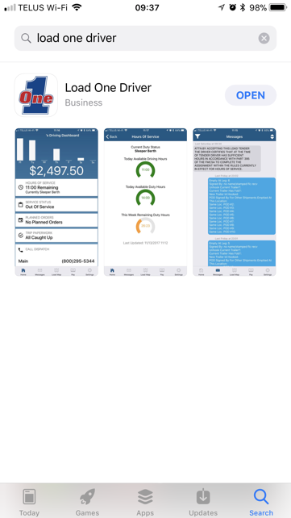
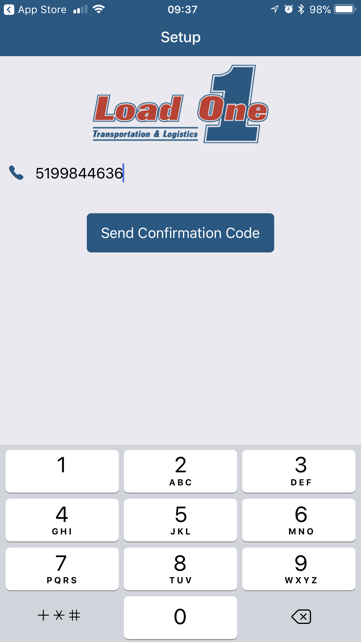
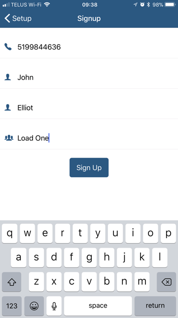
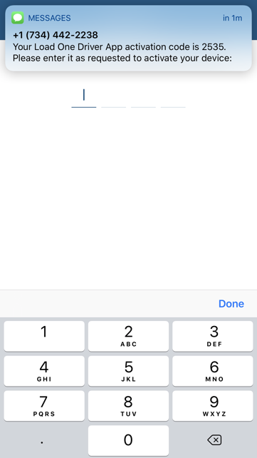
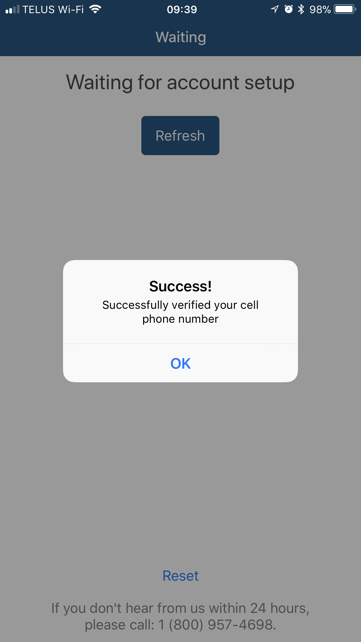
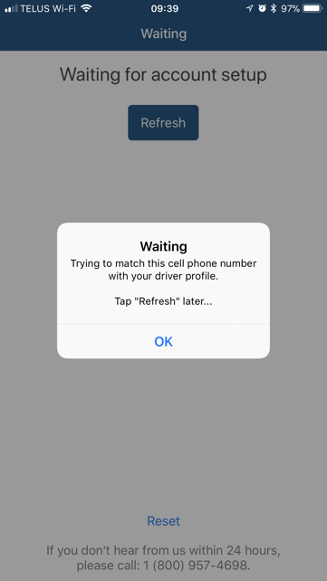

# Disclaimer

The information provided in this document is intended for illustration purposes only and is not a representation of actual driver experience. The application relies on certain third party data and technology and as such, accuracy and timely delivery of information is not guaranteed.

Additional terms and conditions of use of the app can be viewed [here](https://www.load1.com/cms/uploads/website-and-app-terms-and-conditions.pdf).

Screen shots and app behavior described and presented in this document are based on iOS devices. Android users may notice certain differences in appearance, behavior and experience.

# Download

For iOS devices, download the app from the AppStore. For Android devices, download from the Google Play Store. Click on the corresponding link below to start the download to your device:

  
  

# Activation

After downloading Load One Driver from the App Store or Google Play Store, open the app and follow the instructions to have your device activated. After your identity is verified by Load1, you will be able to start using the app.

