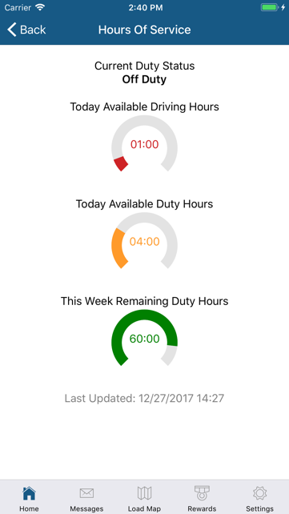

The Hours Of Service (HOS) card displays the lowest of the HOS metrics most recently received from the Omnitracs system. Tap on the card to see all your metrics and current duty status.

!> The app uses Omnitracs HOS data. Information presented is for reference purposes only. Always check your Omnitracs unit for the latest and most accurate HOS metrics.