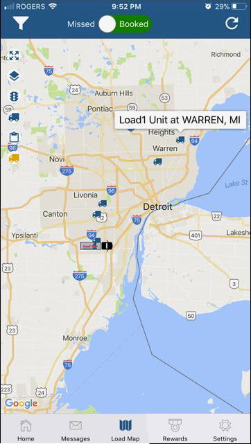

The Load Map tab bar option provides you with two types of visual summaries, Missed Opportunities and Shipments Booked. Missed Opportunities are loads that Load1 could not secure due to various reasons. Booked Shipments are loads that Load1 successfully moved. For both options, the markers displayed represent origin points of loads requiring the same truck class as yours.

By default, the map also displays latest known locations of other In Service Load1 trucks of the same class (blue truck markers).

You will notice that the Load Map has similar features as the Trip Map but with three added toggles on the upper left side.

Tap on the Blue Truck icon to hide or display Load1 truck markers.

Tap on the Order icon to hide or display load markers.

Tap on the Orange Truck icon to hide or display Sylectus truck markers. Sylectus is a third party Truck and Load Board that Load1 subscribes to for obtaining information on carriers’ available capacity. This gives you an extra layer of visibility on other expedite and truck load equipment currently in service.

Tap on the Filter icon to select load information to display. You can view aggregate load counts for each origin point for the last 2 days (default view), last 14 days, last 30 days, or specific days of the past week. Note that for any option selected, the truck locations represent their last known positions.

Slide from Missed to Booked Shipments to view corresponding loads. The same filters and toggles are provided and can be applied when viewing either option.

Focus on a specific area of the map you are interested in getting more information. Press down on the location for a few seconds until the Units In Area screen displays. This will tell you your dispatch position in that area, as well as the number of units in each truck class that are In Service. The information provided is similar to your Omnitracs Macro 19 request.

