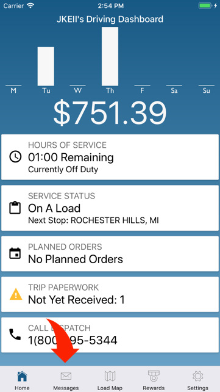
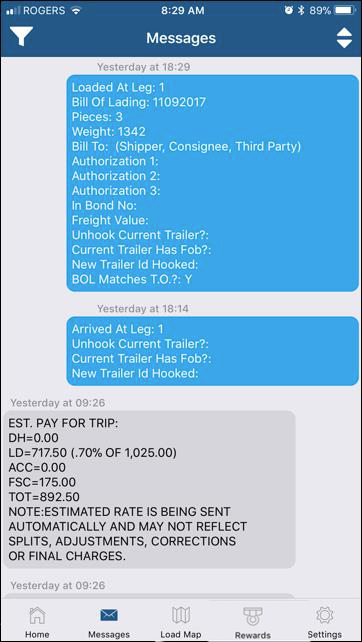
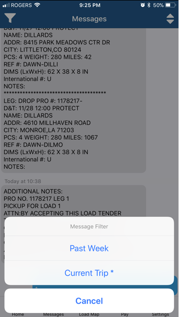
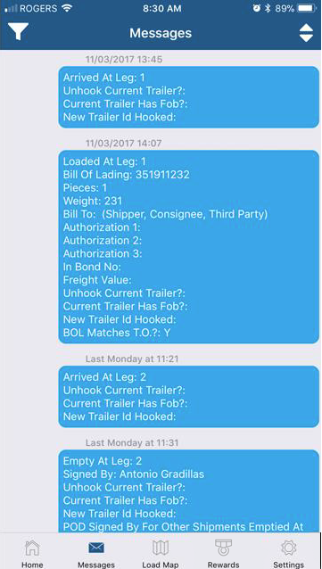
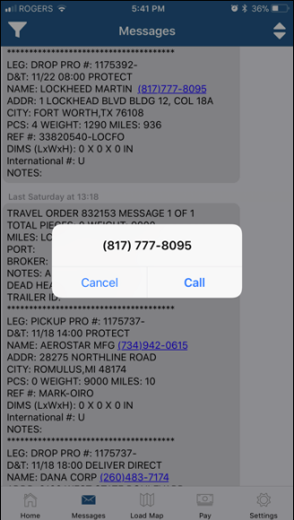
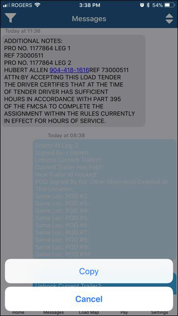
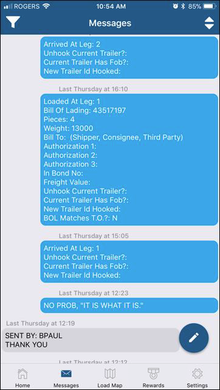
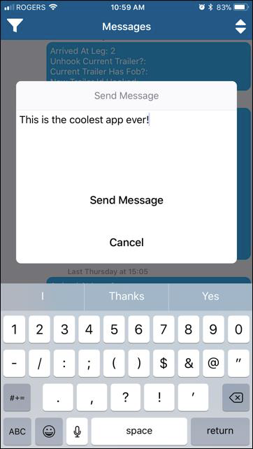

The Messages tab bar option lets you go through your Omnitracs Forward and Return messages in a conversation-like view. The default display is all messages for the past week, starting with the most recent one.

Tapping on the Filter icon and selecting Current Trip displays messages that are related to the trip in progress only. If you are currently not on a load, no messages will be displayed. Tap on the sort icon to reverse the order by which messages are displayed.

You can tap on formatted phone numbers that are contained within messages to call the number.

You can also copy a message. Press the particular message for a few seconds until the Copy/Cancel options appear. Tap on Copy to get the message into the device Clipboard for pasting in another app.

You can also send free form messages by tapping on the pencil icon at the bottom righthand corner of the screen. Type your message and tap on Send Message when ready to send. This will be received by Load1 dispatchers just like they do when sent from your Omnitracs unit.

