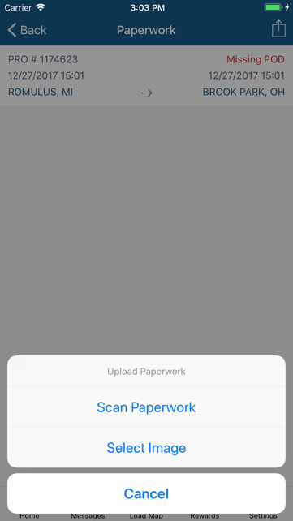
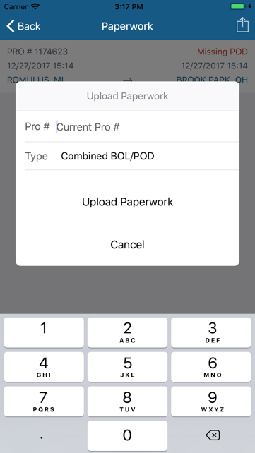
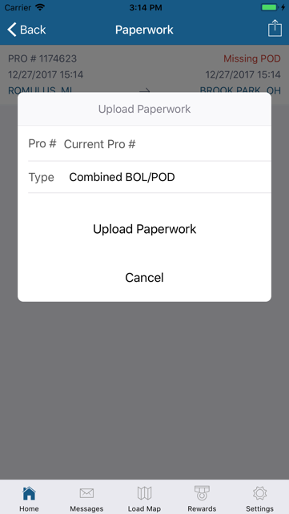
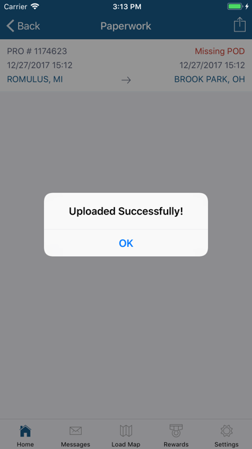

The Trip Paperwork card alerts you if there are any missing paperwork to submit so you can get paid. Tap on the card to identify which orders and type of paperwork are pending submission.

Tap on the particular Order from the list to upload the missing paperwork. You can either take a picture of a document using the camera on your device or choose from pictures stored in the photo library.

A scan feature enables the app to process pictures taken to look like scanned documents. When scanning, use the green overlay guide to help you capture the entire image. When the scanner detects the document, it will automatically take a picture and process it. You can choose to upload the image or retake the picture. Remember that image quality is affected by lighting, camera angle and stability. Make sure the document details are readable before uploading. 

The Pro # and Paperwork Type required are automatically selected. Tap on Upload Paperwork to submit the image chosen.

You can also submit images for past trips by tapping on the Upload/Share icon found on the upper right-hand corner of the Paperwork screen. Scan or select an image to submit.

Enter the Pro # that the image is for or if you’re on a trip, leave it blank to indicate the current trip pro #.

Tap on Paperwork Type to select a different one as necessary. Then tap on Upload Paperwork to submit.

You will be informed when the upload process is complete and if it was successful in sending the image or if an error occurred.

