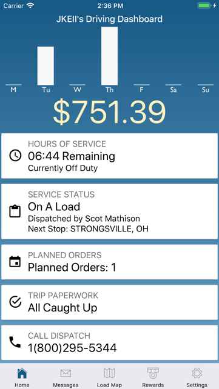
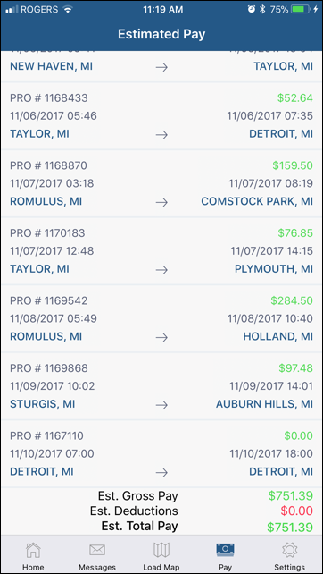

The Daily Pay Graph at the top of the dashboard represents your total estimated pay for each day of the current open pay period. 
The $ value below the graph is the total for all days, net of deductions. 
Tap on the $ value to see a list of all trips in the graph.
For each trip, details and estimated pay are displayed. Estimated gross pay, deductions and total net pay are summarized for your reference.

