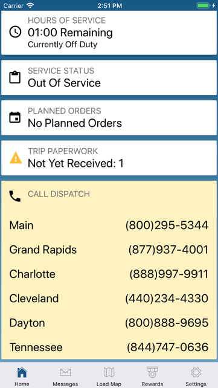
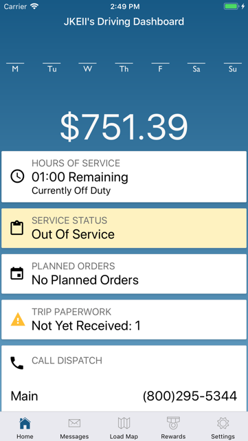

The Service Status card shows if you are In Service, Out of Service or On A Load. If On A Load, it will tell you the trip’s dispatcher (if information is available) and your Next Stop.

The phone number of the dispatch office responsible for your trip is also displayed on the Call Dispatch card.

Tap on the phone number to call the dispatch office.

Tap on the Service Status card to view your Current Trip details and Trip Map that marks all your stops and your latest known position. Map features include zooming in and out, map type selection, traffic information, stop location information and navigation option.

Tap on the navigation icon to open Google Maps app (if installed on your device, otherwise the browser version of Google Maps is opened). Your pending stops are automatically entered as way points and destination. Start routing to get directions from your device location to your next stop.

!> Google Maps does not support commercial truck routing. Directions provided are for reference only and may not match your Omnitracs provided route.

If you are In or Out of Service, the Call Dispatch card provides phone numbers for all Load1 dispatch offices. Tap on any number to call the corresponding office.

If you are Out of Service and ready to go back In Service, tap on the Service Status card and then tap ‘Yes, I’m Ready’ from the screen that pops-up. This will change your status to In Service.

