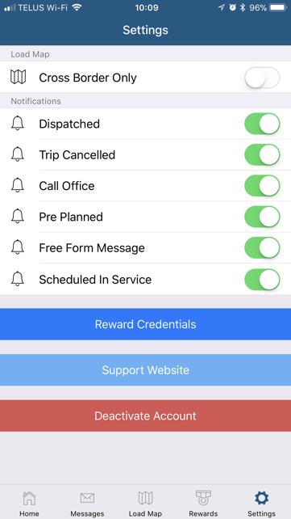
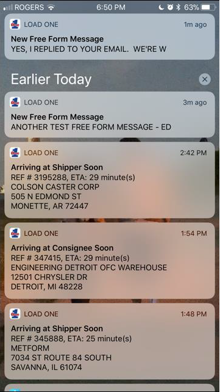
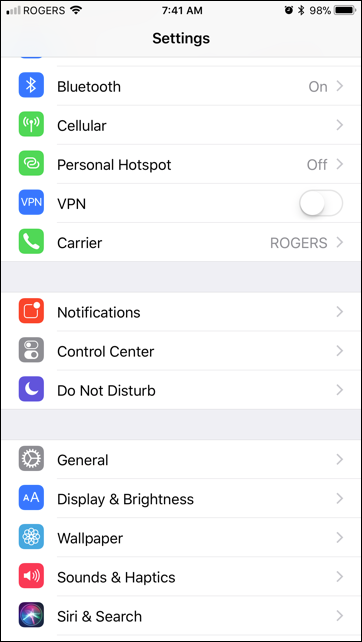
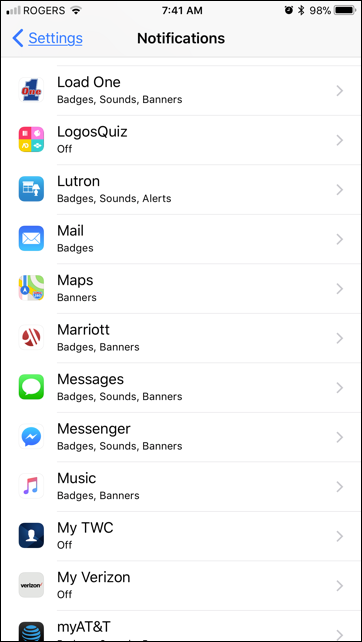
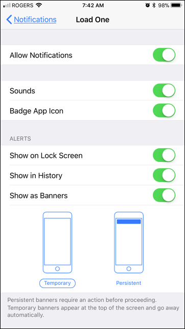
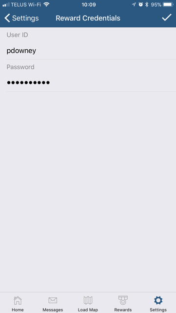

The Settings tab bar option allows you to control the type of Push Notifications you receive on your device and store your Rewards and Training site credentials.

Make sure that you allow Load One Driver app to receive these notifications by going to your device Settings app, then Notifications.

Tap on Load One. Turn on Allow Notifications if it’s currently off.

Tap on Reward Credentials to store your User ID and Password. Tap on the check mark at the upper-right hand corner to save the credentials you entered. Now every time you access the rewards site, the app will use these credentials to automatically log you in. If you change your password in the site, make sure you match the same in the app to successfully access it next time. Navigate the rewards site as you would from a browser.

If you want to discontinue use of the app on your device, tap on Deactivate Account. Doing this keeps the app on your device but disables it from your Load1 driver account. To reactivate, follow steps for [activation](getting-started.md#activation).

