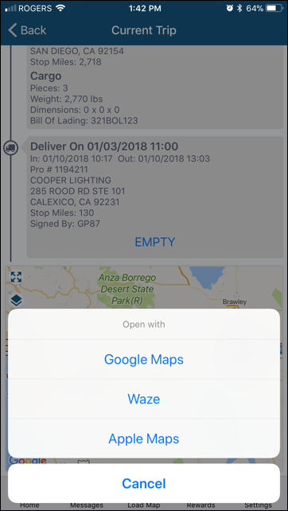
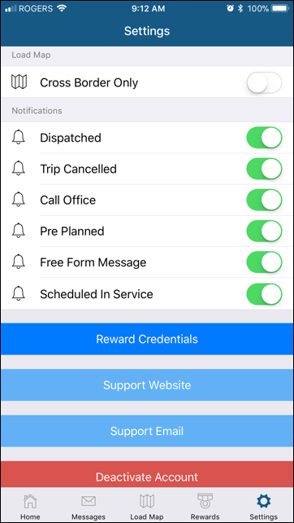

In the Trip Map, when you tap on the Route icon, you are now given options on what routing app to use.&nbsp;&nbsp;For iOS devices, you have an additional option to use Apple Maps:

In the Settings page, links to the support website and email are now available.
 

