Time zones are now displayed for all date/time data.  This will help with troubleshooting issues with devices supposedly not displaying correct PU/DEL times.

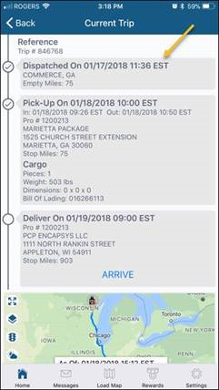

Link to company store. This opens up the browser to navigate site.

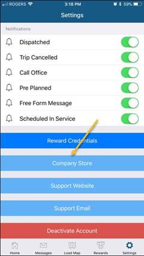

Workflow events are now supported.  You can send ARRIVE, LOAD and EMPTY events when active on a load.

Arrive Event:

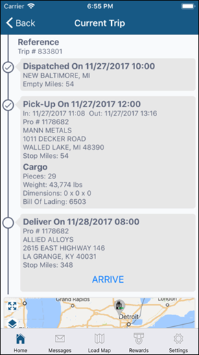
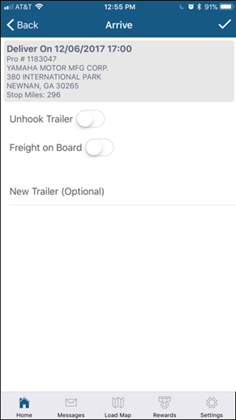

Load Event:

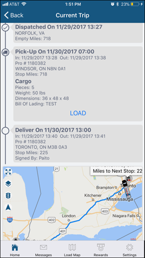
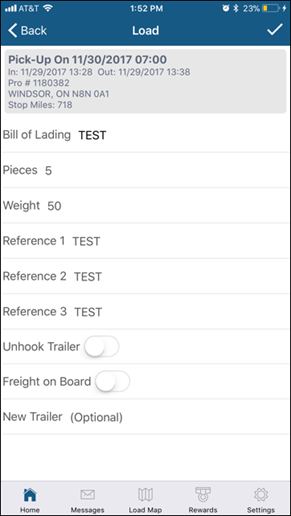

Empty Event:

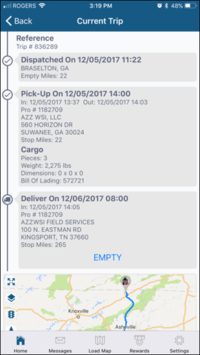
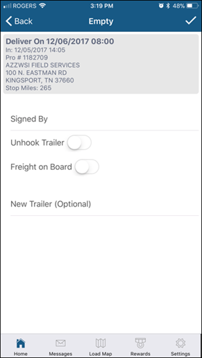

On the HOS screen, we've added 'Until Next Break' hours.

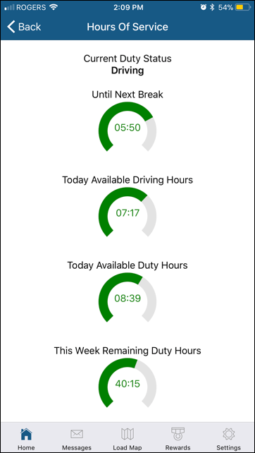

On the Trip Map, when you tap on the Route icon, you are now given options on what routing app to use.  For iOS devices, you have an additional option to use Apple Maps:

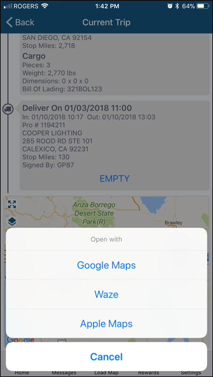

On the Dashboard page, when Out of Service, your next Due In Service date and time are now displayed.

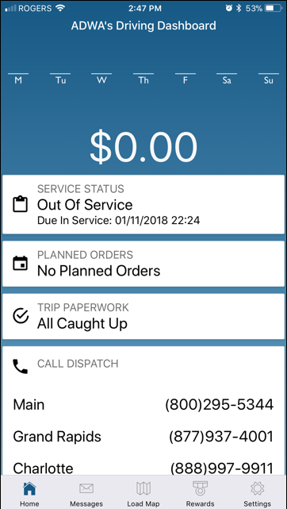

On the Settings page, links to the support website and email are now available.

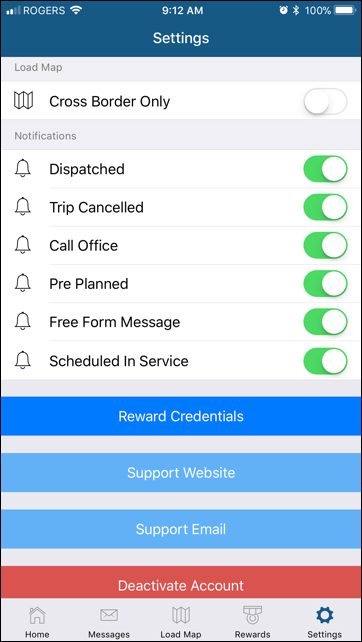

On the Trip and Load Maps, a weather layer icon has been added to toggle display of precipitation patterns.

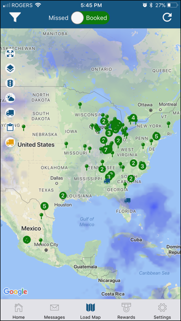

On the Dashboard page, clicking on Out of Service status allows you to mark yourself In Service now.

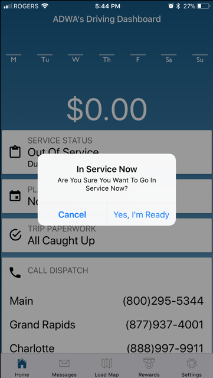
