**02/16/2018**

A new card has been added to the dashboard called EXPIRING DOCUMENTS.  This will alert you of compliance related documents that are expiring within 30 days.  Tapping on the card lists all documents that need to be updated. Tapping on the specific document allows you to automatically email fleetmanagement@load1.com the required document by using any of the upload options (Scan Paperwork, Select PDF, Select Image).

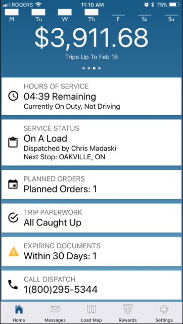
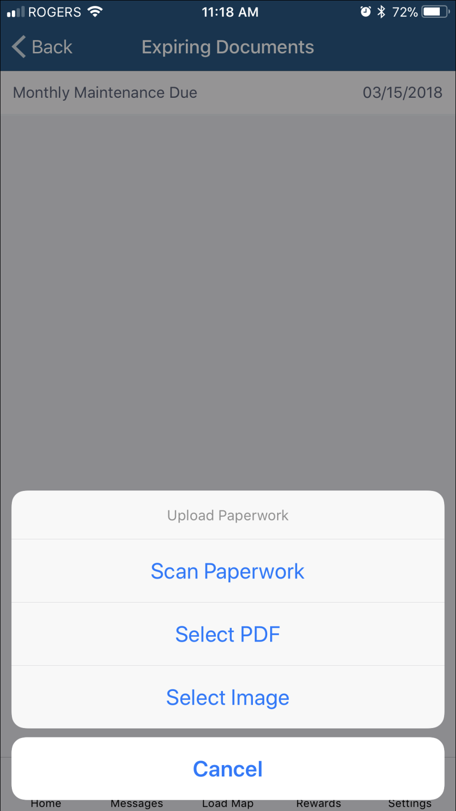

**02/13/2018**

In Paperwork screen, when submitting for past loads, the app will now validate the pro number entered to ensure it's for one of your completed loads.  This avoids sending paperwork for invalid pro numbers thereby reducing turn around time that could result in delayed payment due to errors.

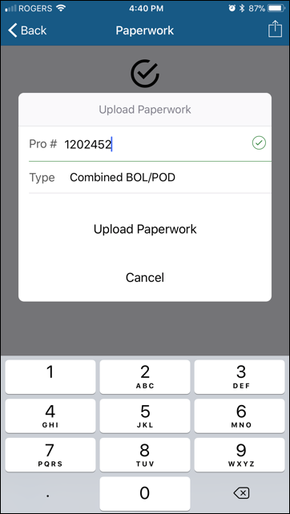

**02/05/2018**

A new option to upload paperwork has been added.  Now you can choose a PDF file.  This is a good alternative for uploading multiple pages all at once.  You can take advantage of your favorite PDF generating third party app to create the PDF and then use the LOD app to upload a single file.  To get this new feature, please download the latest version of the app from the App Store or Google Play Store.

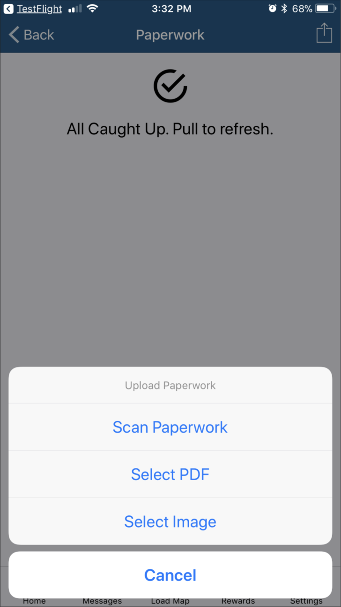
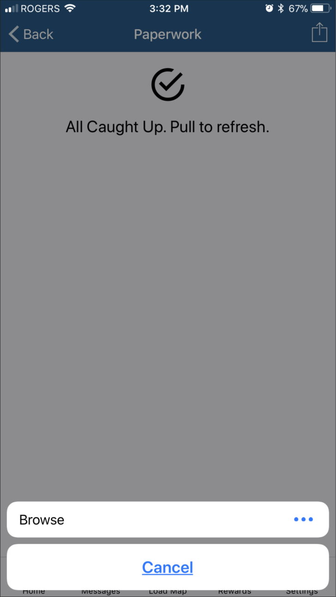
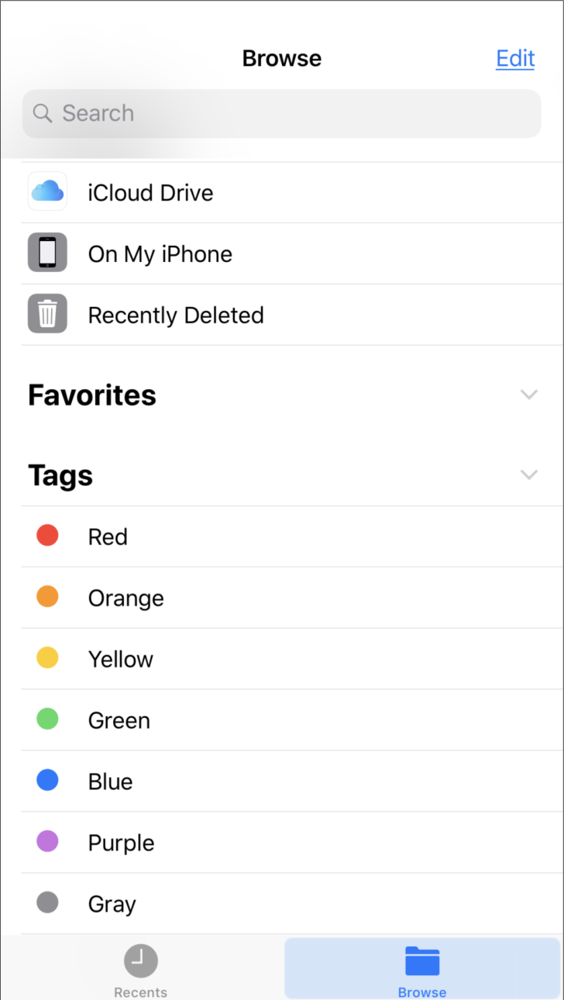

In the Load Map, you can now select 'Today' to display Missed Opportunities or Booked Loads for the current date.  This data will be more dynamic as it looks at live loads coming in as the day progresses.  Please make sure you refresh the screen often to get the latest information.

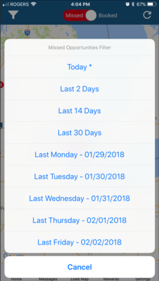

When there is a new version of the app to download, you are now alerted of this on the dashboard.  Click on the alert to get the latest version of the app from the App Store or Google Play Store.

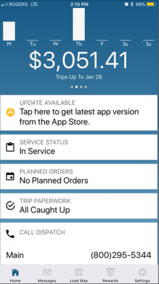

**02/01/2018**

In the Load Map, Load1 trucks with team drivers will now be represented as a blue truck icon with a 'T' in the middle.

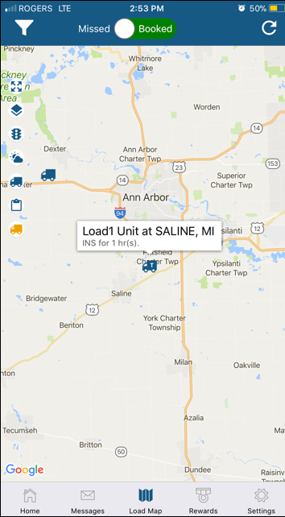

A new Terms and Conditions (T and C) for using the app has been published.  Please read the terms and hit 'I Disagree' or 'I Agree' button.  You won't be allowed to proceed if you don't agree to the terms.  You will also be able to access the T and C from the Settings page if you wish to review it.  In the future, if these terms are updated by Load1, you will be asked to read and agree to it again.  

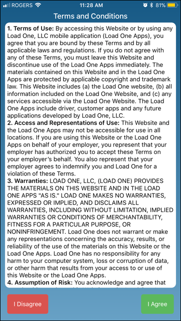
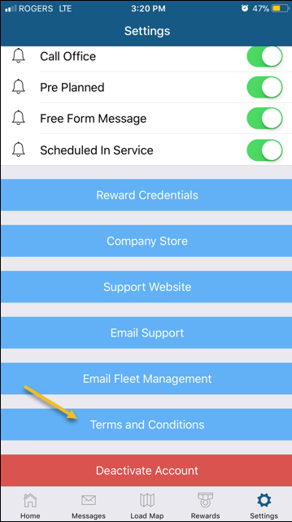

In the Load Map, tapping on a Load1 Unit icon now tells you how long the unit has been in service waiting for a load.

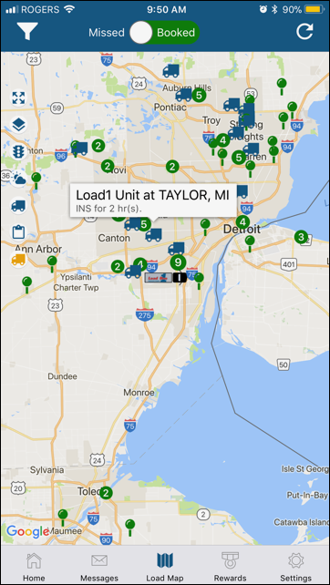

**01/29/2018**

In the Estimated Pay details screen, we now include trips that have not been rated ($0.00) to make it easier for you to reconcile what trips are included in the pay period you are viewing.  Before this update, $0.00 rated trips were not being displayed. If a trip shows $0.00 estimated pay, please contact Load1 so the pay amount can be properly set.

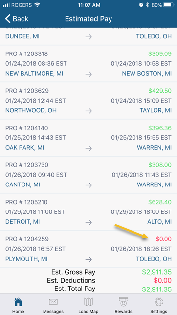

**01/26/2018**

Pay info. for the two previous pay periods, current and next pay period can now be viewed (rotating 4 weeks).  From the dashboard, swipe left or right on the Pay Graph to switch from current to previous or next pay period summary.  Tapping on the Total $ Amount displays trips and estimated totals for the pay period in view.

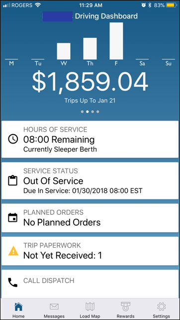
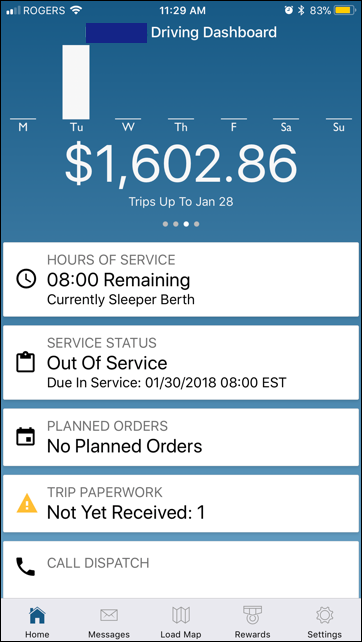

You can now email Fleet Management staff at Load1. This can be done from the Settings Page. Tap on the link ‘Email Fleet Management’ when you have a need to correspond with this group.

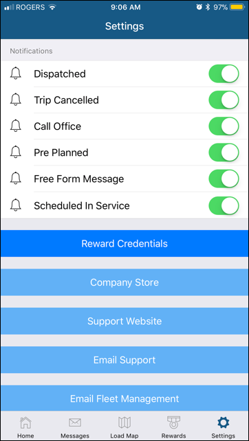

**01/23/2018**

When In Service (and not on a load), you can now tap on the In Service status card to set yourself Out of Service (OOS).  The reason for going OOS must be selected from the list and your estimated in service date/time must also be provided.  The app will let you know if the message was successfully sent or if a processing error occurred.

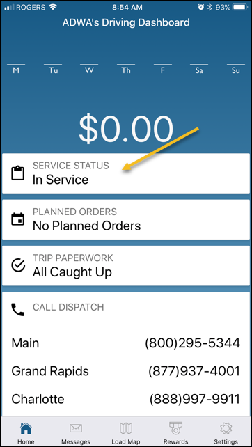
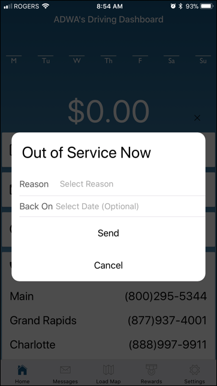
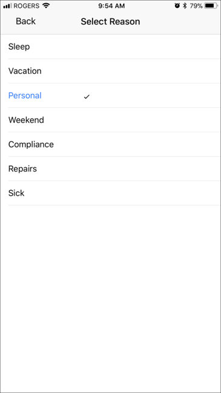
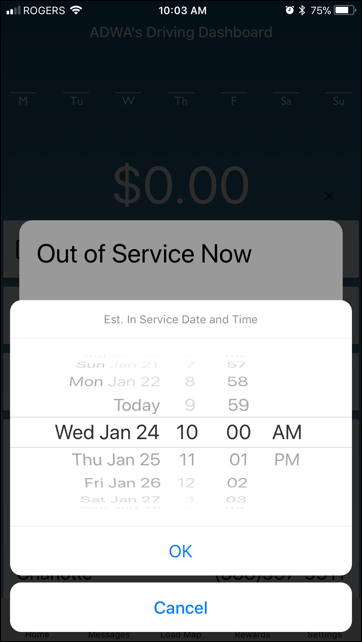
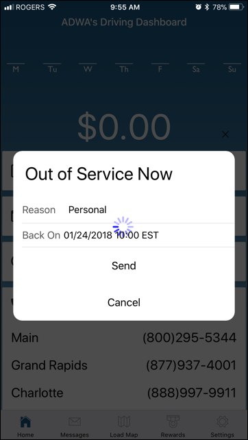
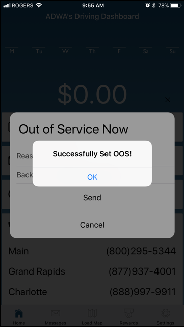

**01/19/2018**

Android scanning is finally here!  For Android users, the paperwork scanning feature is now available just like on iOS devices.  Instead of just taking a picture, the app converts the image to look like scanned paperwork.  Please get the latest Load One Driver app update from the Google Play Store to take advantage of this neat feature.

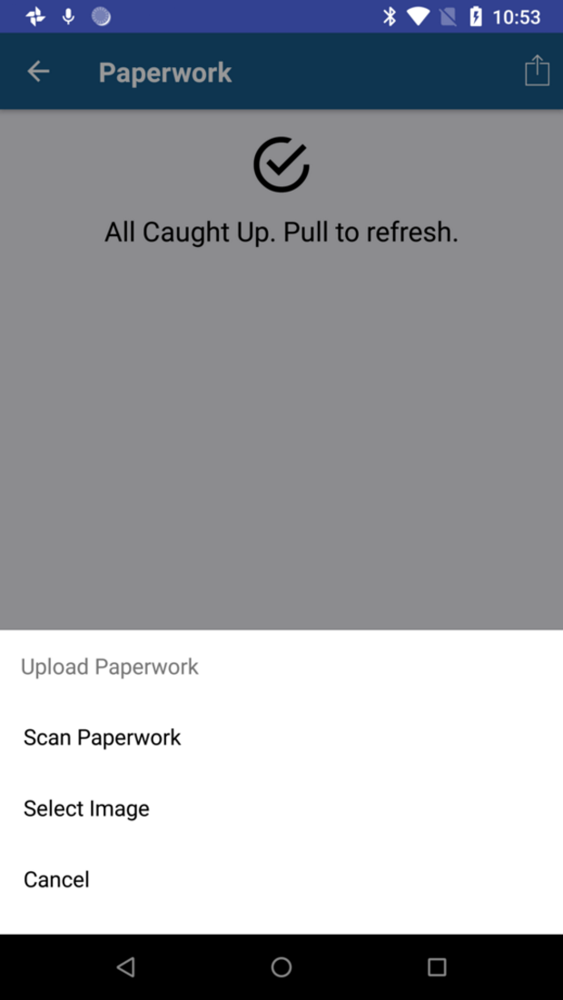
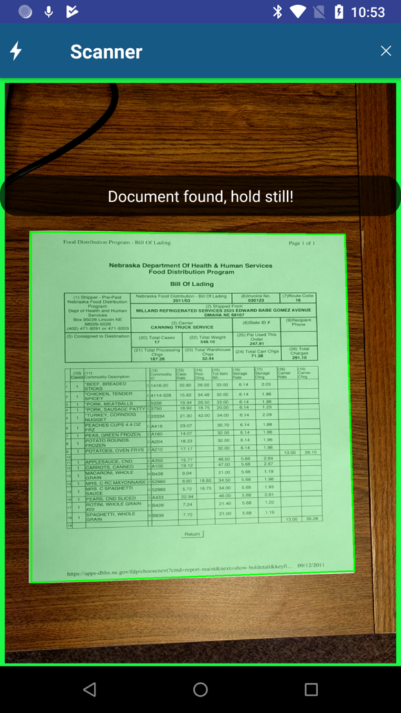
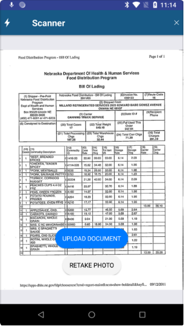

You can now send Fleet Management staff various types of papework from the app.  If you select any paperwork type option below -EMAIL TO FLEET MGMT-, the app will email it to that group. 

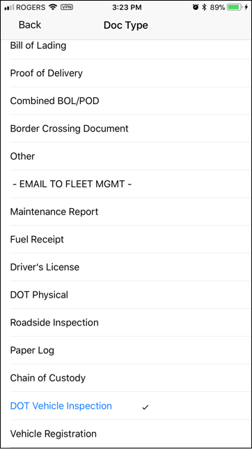

Time zones are now displayed for all date/time data.  This will help in troubleshooting issues with devices supposedly not displaying correct PU/DEL times.

There is now a link to the company store. This opens up the browser to navigate the site.

**01/09/2018**

Workflow events are now supported.  You can send ARRIVE, LOAD and EMPTY events when active on a load.

Arrive Event:

Load Event:

Empty Event:

On the HOS screen, we've added 'Until Next Break' hours.

On the Trip Map, when you tap on the Route icon, you are now given options on what routing app to use.  For iOS devices, you have an additional option to use Apple Maps:

On the Dashboard page, when Out of Service, your next Due In Service date and time are now displayed.

On the Settings page, links to the support website and email are now available.

On the Trip and Load Maps, a weather layer icon has been added to toggle display of precipitation patterns.

On the Dashboard page, clicking on Out of Service status allows you to mark yourself In Service now.

