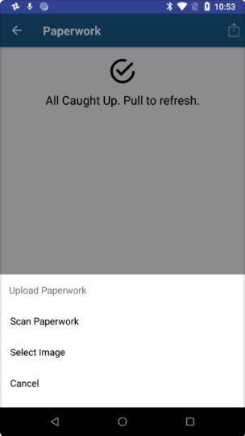

**01/29/2018**

In the Estimated Pay details screen, we now include trips that have not been rated ($0.00) to make it easier for you to reconcile what trips are included in the pay period you are viewing.  If a trip shows $0.00 estimated pay, please contact Load1 so the pay amount can be properly set.

**01/26/2018**

Pay info. for the two previous pay periods, current and next pay period can now be viewed (rotating 4 weeks).  From the dashboard, swipe left or right on the Pay Graph to switch from current to previous or next pay period summary.  Tapping on the Total $ Amount displays trips and estimated totals for the pay period in view.

You can now email Fleet Management staff at Load1. This can be done from the Settings Page. Tap on the link ‘Email Fleet Management’ when you have a need to correspond with this group.

**01/23/2018**

When In Service (and not on a load), you can now tap on the In Service status card to set yourself Out of Service (OOS).  The reason for going OOS must be selected from the list and your estimated in service date/time must also be provided.  The app will let you know if the message was successfully sent or if a processing error occurred.

**01/19/2018**

Android scanning is finally here!  For Android users, the paperwork scanning feature is now available just like on iOS devices.  Instead of just taking a picture, the app converts the image to look like scanned paperwork.  Please get the latest Load One Driver app update from the Google Play Store to take advantage of this neat feature.

You can now send Fleet Management staff various types of papework from the app.  If you select any paperwork type option below -EMAIL TO FLEET MGMT-, the app will email it to that group. 

Time zones are now displayed for all date/time data.  This will help in troubleshooting issues with devices supposedly not displaying correct PU/DEL times.

There is now a link to the company store. This opens up the browser to navigate the site.

**01/09/2018**

Workflow events are now supported.  You can send ARRIVE, LOAD and EMPTY events when active on a load.

Arrive Event:

Load Event:

Empty Event:

On the HOS screen, we've added 'Until Next Break' hours.

On the Trip Map, when you tap on the Route icon, you are now given options on what routing app to use.  For iOS devices, you have an additional option to use Apple Maps:

On the Dashboard page, when Out of Service, your next Due In Service date and time are now displayed.

On the Settings page, links to the support website and email are now available.

On the Trip and Load Maps, a weather layer icon has been added to toggle display of precipitation patterns.

On the Dashboard page, clicking on Out of Service status allows you to mark yourself In Service now.

