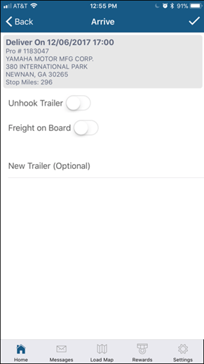
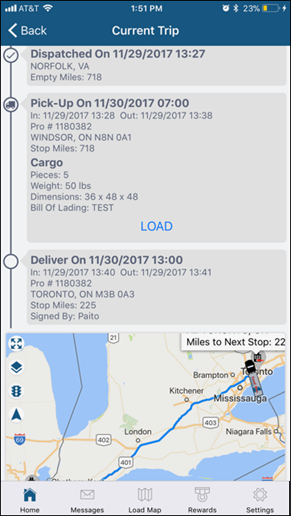

When active on a load, workflow messaging allows you to send the required event or milestone update for the stop that is currently in pending status. This is similar to the Omnitracs Workflow process which helps ensure events are sent in the proper sequence.

The workflow message types you can send are ARRIVE at pick-up or delivery stop, LOAD at pick-up stop and EMPTY at delivery stop.  When sending an event, you just need to provide the milestone details.  The pro number and stop number are automatically handled 
by the app.    

Arrive Event:

Load Event:

Empty Event:

